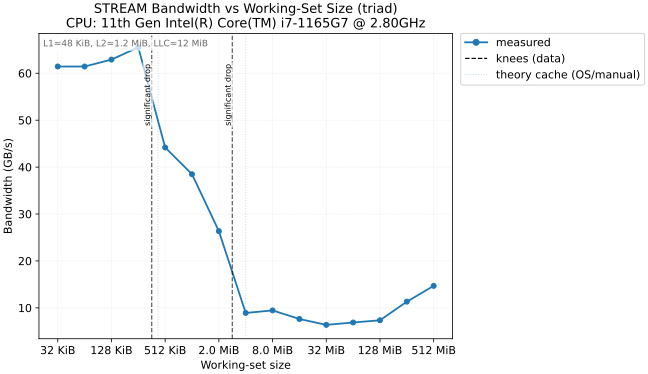
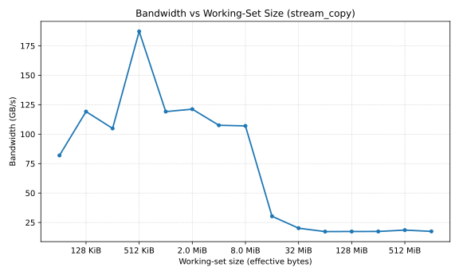
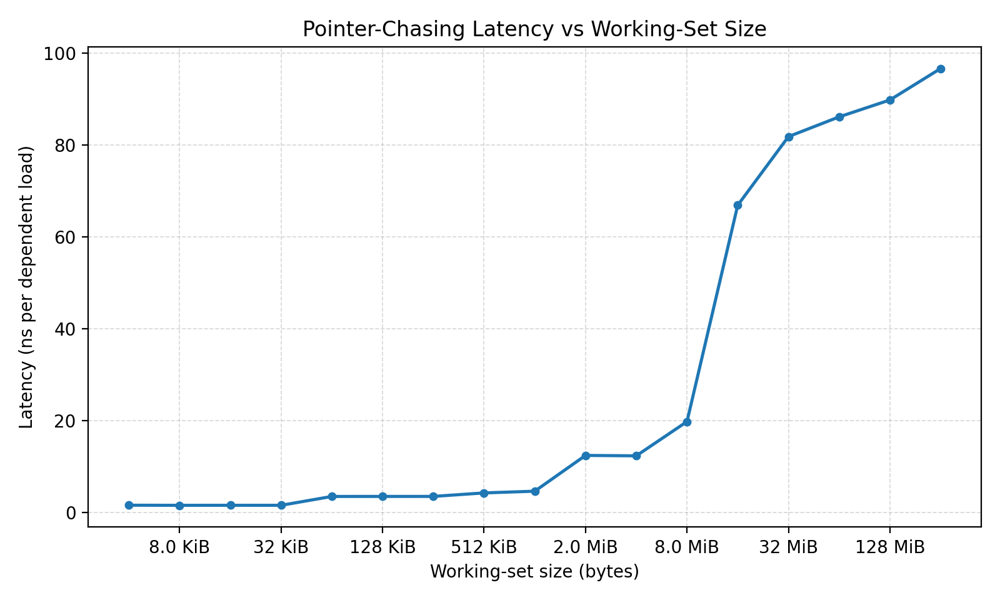

# HPC Performance Benchmark & Optimization Suite

A C++17/OpenMP microbenchmark suite designed to measure memory bandwidth, dependent-load latency, and floating-point compute throughput across the CPU cache/DRAM hierarchy.

Built with **NUMA-aware first-touch initialization**, **anti-DCE (Dead Code Elimination) memory clobbering**, and **pointer-chasing** to defeat hardware prefetchers, with the goal of reflecting hardware behavior rather than compiler artifacts. The suite ships with profiling hooks for `perf` hardware counters, `valgrind` cache simulation, and `llvm-mca` static throughput analysis (Linux/WSL).

## Key Architectural Findings (Intel i7-1165G7 - Tiger Lake)

*Observed under controlled conditions: 50 warmup passes, 200 iterations, 64-byte aligned.*

1.  **Memory Latency**: Pointer-chasing reveals distinct hierarchy tiers: **~2.1 ns** (L1), **~4.2 ns** (L2), **~5-14 ns** (LLC), and a steep wall at **~93 ns** (DRAM).
2.  **Memory Bandwidth**: Multi-core saturation (OpenMP) achieves **187 GB/s** in the L2 cache (STREAM Copy) before dropping to **~20 GB/s** sustained DRAM bandwidth. The data shows a clear transition consistent with the 12 MB LLC boundary.
3.  **Compute Throughput**: Single-core aligned execution highlights vectorization variance. **FLOPS** (`x*a+b`) achieved **39.6 GFLOPS** via SIMD autovectorization, while **FMA** (`std::fma`) stalled at **1.2 GFLOPS** due to scalar serialization.

## Benchmark Results - Intel i7-1165G7 (Tiger Lake)

**Platform:** Intel Core i7-1165G7 @ 2.80GHz - MSVC 1929 - Windows 11  
**Run config:** `--warmup 50 --iters 200 --prefault --aligned`  
**Threading:** STREAM/DOT/SAXPY: 4 threads (OpenMP) | FMA/FLOPS: 1 thread (execution core)

---

### Memory Bandwidth (STREAM Suite)

All STREAM kernels sweep per-array working-set sizes from 32 KB up to 512 MB.
**High bandwidths** (>100 GB/s) are achieved by determining independent memory streams across **4 physical cores** (OpenMP).

#### Peak Bandwidth Summary

| Kernel | Operation | Arrays | **Peak BW (LLC)** | **DRAM Sustained** |
|--------|-----------|:------:|:-----------------:|:-----------------:|
| Copy   | `B[i] = A[i]` | 2 | **187.2 GB/s** @ 256 KB/array | ~17-18 GB/s |
| Add    | `C[i] = A[i]+B[i]` | 3 | **170.0 GB/s** @ 1 MB/array | ~20 GB/s |
| Triad  | `A[i] = B[i]+s*C[i]` | 3 | **102.1 GB/s** @ 256 KB/array | ~20 GB/s |
| Scale  | `B[i] = s*A[i]` | 2 | **90.4 GB/s** @ 4 MB/array | ~15-17 GB/s |

#### STREAM Triad - Full Sweep (standard HPC metric)

| Per-array size | Total footprint | Bandwidth (GB/s) | Tier |
|---|---|:---:|---|
| 32 KB | 96 KB | 75.6 | L1 |
| 64 KB | 192 KB | 89.4 | L1/L2 |
| 128 KB | 384 KB | 91.4 | L2 |
| **256 KB** | **768 KB** | **102.1 <- Peak** | **L2** |
| 512 KB | 1.5 MB | 97.7 | L2 |
| 1 MB | 3 MB | 95.9 | LLC |
| 2 MB | 6 MB | 96.2 | LLC |
| 4 MB | 12 MB | 69.6 | LLC tail |
| 8 MB | 24 MB | 25.3 | LLC->DRAM **cliff** |
| 16 MB | 48 MB | 21.7 | DRAM |
| 32–512 MB | 96 MB–1.5 GB | 19.7–20.3 | DRAM (stable) |

> **10x drop** from L2 peak (102 GB/s) to DRAM (20 GB/s). The cliff at 4->8 MB/array (2.75x drop in a single doubling) marks the 12 MB LLC boundary.



#### STREAM Copy - Full Sweep

| Per-array size | Total footprint | Bandwidth (GB/s) | Tier |
|---|---|:---:|---|
| 32 KB | 64 KB | 81.9 | L1 |
| 64 KB | 128 KB | 119.2 | L1/L2 |
| 128 KB | 256 KB | 104.9 | L2 |
| **256 KB** | **512 KB** | **187.2 <- Peak** | **L2** |
| 512 KB | 1 MB | 119.2 | L2 |
| 1 MB | 2 MB | 121.2 | LLC |
| 2 MB | 4 MB | 107.5 | LLC |
| 4 MB | 8 MB | 107.0 | LLC |
| 8 MB | 16 MB | 30.3 | LLC->DRAM **cliff** |
| 16 MB | 32 MB | 20.2 | DRAM |
| 32-512 MB | 64 MB-1 GB | 17.3-18.5 | DRAM (stable) |



#### STREAM Scale - Full Sweep

| Per-array size | Total footprint | Bandwidth (GB/s) | Tier |
|---|---|:---:|---|
| 32 KB | 64 KB | 65.5 | L1 |
| 64 KB | 128 KB | 72.8 | L1/L2 |
| 128 KB | 256 KB | 77.1 | L2 |
| 256 KB | 512 KB | 83.2 | L2 |
| 512 KB | 1 MB | 88.1 | L2/LLC |
| 1 MB | 2 MB | 90.0 | LLC |
| 2 MB | 4 MB | 89.9 | LLC |
| **4 MB** | **8 MB** | **90.4 <- Peak** | **LLC** |
| 8 MB | 16 MB | 32.6 | LLC->DRAM **cliff** |
| 16 MB | 32 MB | 20.1 | DRAM |
| 32-512 MB | 64 MB-1 GB | 15.3-17.7 | DRAM (stable ~16) |

#### STREAM Add - Full Sweep

| Per-array size | Total footprint | Bandwidth (GB/s) | Tier |
|---|---|:---:|---|
| 32 KB | 96 KB | 89.4 | L1 |
| 64 KB | 192 KB | 103.5 | L1/L2 |
| 128 KB | 384 KB | 135.6 | L2 |
| 256 KB | 768 KB | 157.3 | L2 |
| 512 KB | 1.5 MB | 165.6 | L2/LLC |
| **1 MB** | **3 MB** | **170.0 <- Peak** | **LLC** |
| 2 MB | 6 MB | 165.1 | LLC |
| 4 MB | 12 MB | 111.0 | LLC tail |
| 8 MB | 24 MB | 25.7 | LLC->DRAM **cliff** |
| 16 MB | 48 MB | 19.3 | DRAM |
| 32-512 MB | 96 MB-1.5 GB | 19.6-20.5 | DRAM (stable ~20) |

> **Note:** 3-array kernels (Add, Triad) sustain ~20 GB/s in DRAM vs ~16-18 GB/s for 2-array kernels (Copy, Scale). More concurrent outstanding cache-line requests improve DRAM controller pipeline utilization.

---

### Compute Throughput (GFLOPS)

FMA/FLOPS run in **single-threaded** fallback loops with `--aligned`.
- **FLOPS:** SIMD auto-vectorized by MSVC.
- **FMA:** Failed to vectorize (scalar serial) due to `std::fma` barrier.

| Kernel | Operation | Median time | **GFLOPS** | Bottleneck (Single Core) |
|--------|-----------|:-----------:|:---------:|--------------------------|
| **FLOPS** | `x = x*a + b` (4 acc) | 25.9 ms | **39.61** | **Vectorized** ILP saturation |
| **DOT**   | `sum += x[i]*y[i]` (4 threads) | 3.4 ms | **4.65** | Memory (read-only BW) |
| **SAXPY** | `out[i] = a*x[i] + y[i]` (4 threads) | 9.5 ms | **1.68** | Memory (read+write BW) |
| **FMA**   | `x = std::fma(x, a, b)` (4 acc) | 856 ms | **1.20** | **Scalar** latency chain (no vectorization) |

**Code Generation finding:**
The massive **33x speedup** (39.6 vs 1.2 GFLOPS) is primarily due to **auto-vectorization failure** on `std::fma` in the single-threaded loop, while FLOPS was successfully auto-vectorized. This result suggests that, under this MSVC configuration, the `std::fma` version was not vectorized and achieved much lower throughput than the separate MUL+ADD version.

---

### Memory Latency (Pointer Chase)

Randomized pointer walk (`p = *p`) defeats hardware prefetchers. Every load depends on the result of the previous one, which helps isolate dependent-load latency by defeating hardware prefetching.

| Working set | ns/access | Cycles @ 2.8 GHz | Tier |
|---|:---:|:---:|---|
| 4-16 KB | **2.07-2.12** | **~6** | **L1** |
| 32 KB | 2.60 | ~7 | L1/L2 boundary |
| 64-256 KB | **4.2-4.5** | **~12-13** | **L2** |
| 512 KB | 5.2 | ~15 | L2->LLC |
| 1-2 MB | **5.3-13.9** | **~15-39** | **LLC** |
| 64-256 MB | **~92-96** | **~258-269** | **DRAM (stable)** |

> High variance in the 4-16 MB range (stddev ~ 8-18 ms) is caused by the LLC->DRAM transition coinciding with Windows OS scheduling jitter. Use the 64-256 MB DRAM readings (~93 ns) as the reliable DRAM latency figure.



---

### Memory Hierarchy Summary

| Tier | Size | Peak BW | Latency | vs. DRAM BW | vs. DRAM Latency |
|------|------|:-------:|:-------:|:-----------:|:----------------:|
| **L1** | 48 KB | ~190 GB/s | ~2.1 ns | **~9.5x** | **~45x faster** |
| **L2** | 1.25 MB | ~187 GB/s | ~4.2 ns | **~9.4x** | **~22x faster** |
| **LLC** | 12 MB | ~100 GB/s | ~5-14 ns | **~5x** | **~15x faster** |
| **DRAM** | 15 GB | ~20 GB/s | ~93 ns | 1x (baseline) | 1x (baseline) |

---

### Measurement Quality

| Benchmark | Warmup | Timed iters | Statistic | Noise assessment |
|-----------|:------:|:-----------:|:---------:|------------------|
| STREAM (all kernels) | 50 | 200 | Median | Low |
| Compute (FLOPS/DOT/SAXPY/FMA) | 50 | 200 | Median | Very low |
| Latency - L1 / L2 | 50 | 200 | Median | Low |
| Latency - 4-16 MB (LLC transition) | 50 | 200 | Median | **High** (OS jitter) |
| Latency - DRAM (64-256 MB) | 50 | 200 | Median | Moderate |

---

## Features & Methodology

This project implements rigorous controls to measure the theoretical hardware limits of a machine in three key areas:
1.  **Memory Bandwidth** (GB/s)
2.  **Memory Latency** (ns)
3.  **Compute Throughput** (GFLOP/s)

**Methodology (The Performance Contract):**
Microbenchmarks are sensitive to system noise. This project ensures accuracy by:
*   **NUMA First-Touch**: Arrays initialized in `#pragma omp parallel for schedule(static)` blocks matching the kernel layout to ensure local physical page binding.
*   **Parallel Prefault** (`--prefault`): Pre-commits pages in parallel to avoid first-touch page faults during timed regions.
*   **Compiler Barriers**: `clobber_memory()` prevents instruction hoisting and reordering across timer boundaries.
*   **Anti-DCE**: Checksums are computed and passed to `do_not_optimize_away()` to prevent dead code elimination.
*   **Statistical Rigor (Why Median?)**: Reports rely on **Median** and **P95** rather than simple averages. The median naturally filters out OS context-switch spikes, isolating the true hardware baseline. P95 exposes interrupt-driven tail jitter that the median hides.

**Industrial-Grade Design:**
*   **Single Binary**: CLI-driven mode switching (`--kernel stream`/`latency`).
*   **JSON Output**: structured logs for automated analysis.
*   **Integration**: Profiling hooks for `perf`, `valgrind`, and `llvm-mca`.

### How to get stable measurements

| Platform | Recommended command |
| :--- | :--- |
| Linux | `taskset -c 0-7 OMP_NUM_THREADS=8 ./bench --kernel triad --warmup 50 --iters 200 --prefault` |
| Windows | `$env:OMP_NUM_THREADS=8; bench.exe --kernel triad --warmup 50 --iters 200 --prefault` |

**Stability checklist:**
- Set `OMP_NUM_THREADS` to your **physical** core count (avoid hyperthreads for bandwidth tests).
- Use `--warmup 50` or higher to stabilize CPU frequency (DVFS) and cache state.
- Use `--iters 200` or higher for a statistically stable median/P95.
- Use `--prefault` to move page-fault latency outside the timed region.
- Run 3–5 trials and report median-of-medians per size for reproducible comparisons.

---

## Architecture Overview

### OpenMP Parallelism
STREAM, DOT, and SAXPY kernels are fully multi-threaded via OpenMP. All loops use `schedule(static)` for deterministic, balanced chunk assignment matching the NUMA initialization layout. The `latency` kernel is serial by design. The FLOPS and FMA measurements in this report were run single-core (`--aligned` fallback) to isolate per-core compute behavior.

### NUMA-Aware First-Touch Initialization
All benchmark arrays are initialized inside `#pragma omp parallel for schedule(static)` blocks **before** measurement begins. This triggers the OS first-touch policy, assigning physical memory pages to the NUMA node and CPU socket that will later process them. Applied in both `stream_sweep.cpp` and `compute_bench.cpp`. The optional `--prefault` pass is also parallelized to preserve NUMA binding.

### SIMD Vectorization
`RESTRICT`-qualified pointer macros (`__restrict__` GCC/Clang, `__restrict` MSVC) are applied to all kernel arguments in `stream_kernels.hpp`. This helps the compiler generate vectorized AVX/AVX2/AVX-512 code without extra aliasing checks. `#pragma omp simd` is avoided to maintain compatibility with MSVC's OpenMP 2.0 implementation.

### FMA Throughput Optimization
`compute_fma_kernel` and `compute_flops_kernel` use a 4-accumulator unrolled inner loop, replacing the previous single-scalar serial chain. This is intended to expose sustained FMA throughput rather than a single serial dependency chain. A single-scalar chain stalls every 4–5 cycles; 4 independent accumulators can issue 1 FMA per cycle per port.

### Aligned Memory (`include/aligned_buffer.hpp`)
`benchmark::AlignedBuffer<T>` is a move-only RAII allocator providing exact 64-byte aligned storage. The constructor validates that the requested alignment is a power of 2 before dispatching to `posix_memalign` (POSIX) or `_aligned_malloc` (Windows).

---

## Build Modes

| Config | Compiler flags | Purpose |
| :--- | :--- | :--- |
| **Debug** | `/Od /Zi` (MSVC) - `-O0 -g` (GCC/Clang) + OpenMP | Development, correctness checks |
| **Release** | `/O2 /fp:fast` (MSVC) - `-O3 -march=native -ffast-math` (GCC/Clang) + LTO | Real performance measurement |

**Release-only features:**
- `-march=native` (GCC/Clang) tunes code generation for the current CPU, enabling AVX/AVX2/AVX-512 where available. MSVC does not receive an explicit `/arch` flag in this build - SIMD width is determined by the default compiler target.
- `-ffast-math` / `/fp:fast` allows the compiler to reassociate floating-point reductions and fuse multiply-add chains.
- **Link-Time Optimization (LTO)** is enabled via `check_ipo_supported()` and `INTERPROCEDURAL_OPTIMIZATION_RELEASE`, allowing the linker to inline and optimize across translation units.

> Always benchmark the **Release** build. Debug builds run 10-100x slower and do not reflect hardware capability.

---

## Requirements

| Dependency | Version | Notes |
|---|---|---|
| C++ compiler | C++17 capable | MSVC 2019+, GCC 9+, Clang 10+ |
| CMake | ≥ 3.15 | |
| OpenMP | 2.0+ | Bundled with MSVC; default on GCC/Clang |
| Python | 3.9+ | Automation scripts and plotting only |
| pandas | ≥ 2.0 | `pip install -r scripts/requirements.txt` |
| matplotlib | ≥ 3.7 | `pip install -r scripts/requirements.txt` |

**Python environment setup (scripts only):**
```powershell
python -m venv .venv
.venv\Scripts\Activate.ps1          # Windows
pip install -r scripts/requirements.txt
```

---

## How to Run

### Build (Release Mode)

The `Release` configuration is **mandatory for benchmarking**. On GCC/Clang it enables `-O3`, `-march=native`, and `-ffast-math`; on MSVC it uses `/O2` and `/fp:fast`. LTO is enabled where the toolchain supports it. Debug builds run 10–100× slower and will not reflect real hardware capability.

**Windows (PowerShell)**:
```powershell
mkdir build -ErrorAction SilentlyContinue; cd build
cmake .. -DCMAKE_BUILD_TYPE=Release
cmake --build . --config Release
```

**Linux / macOS**:
```bash
mkdir build && cd build
cmake .. -DCMAKE_BUILD_TYPE=Release
cmake --build . --config Release
```

> **OpenMP is required.**
> - **GCC/Clang**: included by default.
> - **MSVC (Windows)**: OpenMP 2.0 runtime is bundled with Visual Studio.
>   *(This project uses compatible OpenMP pragmas for MSVC support.)*

**Debug build (development only):**
```powershell
cmake --build . --config Debug
```

### Quick sanity check (~2 seconds)

```powershell
# Windows
.\build\Release\bench.exe --kernel copy --warmup 2 --iters 5
```
```bash
# Linux / macOS
./build/bench --kernel copy --warmup 2 --iters 5
```

### Control OpenMP thread count

All bandwidth kernels are multi-threaded via OpenMP. Set the thread count before running:

```powershell
# Windows PowerShell
$env:OMP_NUM_THREADS = "4"
.\build\Release\bench.exe --kernel triad --warmup 50 --iters 200 --prefault
```
```bash
# Linux / macOS
export OMP_NUM_THREADS=4
./build/bench --kernel triad --warmup 50 --iters 200 --prefault
```

> For DRAM bandwidth tests, set `OMP_NUM_THREADS` to your **physical** core count to saturate the memory controller.

### End-to-end suite (recommended)

Activate the venv and install Python deps once:

```powershell
& .\.venv\Scripts\Activate.ps1
python -m pip install -r scripts\requirements.txt
```

For the most reproducible numbers, use CPU pinning and high-priority execution (**sterile run**):

**Windows (CMD - pinned & high priority):**
```cmd
set OMP_NUM_THREADS=4
start "" /wait /affinity FF /high python scripts\run_suite.py --config Release --repeats 3 --warmup 50 --iters 200 --prefault --aligned
```
> `/affinity FF` pins to the first 8 logical processors (adjust hex mask to your core count: `F`=4 cores, `FF`=8 cores).

**Linux / macOS:**
```bash
export OMP_NUM_THREADS=4
taskset -c 0-3 python scripts/run_suite.py --config Release --repeats 3 --warmup 50 --iters 200 --prefault --aligned
```

Outputs:
- `results/raw/*.json` - per-run raw JSON + captured stdout/stderr
- `results/summary/*_agg.json` / `*_agg.csv` - aggregated statistics
- `plots/*.svg` - bandwidth vs size + latency vs size

### Manual baseline

```powershell
# Windows PowerShell
$env:OMP_NUM_THREADS = "8"
.\build\Release\bench.exe --kernel triad --warmup 50 --iters 200 --prefault --out results.json
```
```bash
# Linux / macOS
OMP_NUM_THREADS=8 ./build/bench --kernel triad --warmup 50 --iters 200 --prefault --out results.json
```

### Generate Plots & Export Data

The plotting scripts support two analytical modes. Use `--mode research` to detect hidden architectural knees; use `--export-csv` for pandas-compatible output tables:

```bash
# Bandwidth waterfall - research mode with CSV export
python scripts/plot_bandwidth_vs_size.py results/summary/stream_triad_agg.json --mode research --export-csv

# Latency staircase
python scripts/plot_latency_vs_size.py results/summary/latency_ptr_chase_agg.json
```

---

## CLI Reference

### Kernels

| `--kernel` value | What it measures | Threading |
|---|---|---|
| `copy` / `stream_copy` | `B[i] = A[i]` - pure read+write BW | OpenMP (all cores) |
| `scale` / `stream_scale` | `B[i] = s*A[i]` - scale+write BW | OpenMP |
| `add` / `stream_add` | `C[i] = A[i]+B[i]` - 3-array BW | OpenMP |
| `triad` / `stream_triad` | `A[i] = B[i]+s*C[i]` - standard HPC BW | OpenMP |
| `stream` | Alias for `triad` | OpenMP |
| `flops` | `x = x*a + b` - compute throughput | Single core (`--aligned`) |
| `fma` | `x = std::fma(x,a,b)` - compute throughput | Single core (`--aligned`) |
| `dot` | `sum += x[i]*y[i]` - memory-bound FLOPS | OpenMP |
| `saxpy` | `out[i] = a*x[i]+y[i]` - memory-bound FLOPS | OpenMP |
| `latency` | Pointer-chase - true load latency | Single core |

### Flags

| Flag | Default | Description |
|---|---|---|
| `--kernel <name>` | `stream` | Kernel to run (see table above) |
| `--size <str>` | `64MB` | Per-array dataset size (e.g. `128KB`, `256MB`) |
| `--threads <n>` | `1` | Worker threads (override with `OMP_NUM_THREADS`) |
| `--iters <n>` | `100` | Timed iterations |
| `--warmup <n>` | `10` | Warmup iterations (not timed) |
| `--out <file>` | `results.json` | JSON output path |
| `--prefault` | off | Pre-fault pages before timing (recommended) |
| `--aligned` | off | Use 64-byte-aligned allocations |
| `--seed <n>` | `14` | RNG seed for latency pointer shuffle |

### JSON Output Schema

```json
{
  "config":   { "kernel": "triad", "size": "64MB", "iters": 200, "warmup": 50, "aligned": true, "prefault": true },
  "metadata": { "platform": { "cpu_model": "...", "compiler": "MSVC 1929", "os": "Windows", "logical_cores": 8 }, "timestamp": "..." },
  "stats": {
    "performance": { "bandwidth_gb_s": 0.0, "gflops": 4.65, "avg_ns_per_op": 3437350.0 },
    "sweep": [
      { "size_bytes": 32768, "bandwidth_gb_s": 75.6, "median_ns": 1270, "p95_ns": 1340, "stddev_ns": 28 }
    ]
  }
}
```

> `stats.performance` is populated for single-point kernels (`dot`, `saxpy`, `flops`, `fma`, `latency`).  
> `stats.sweep` is populated for STREAM kernels - one entry per working-set size.

---

## Interpreting Results

### Memory Bandwidth (STREAM kernels)

Measures how fast the system moves data through the memory hierarchy:

| Kernel | Operation | Bytes moved per element | What stresses |
| :--- | :--- | :---: | :--- |
| `copy` | `B[i] = A[i]` | 2x | Pure memory movement |
| `scale` | `B[i] = s*A[i]` | 2x | Memory + light scalar multiply |
| `add` | `C[i] = A[i] + B[i]` | 3x | Higher traffic - 2 reads, 1 write |
| `triad` | `A[i] = B[i] + s*C[i]` | 3x | **Standard HPC metric** (McCalpin STREAM) |

Bandwidth forms a **waterfall**: very high for small (cache-resident) working sets, then drops sharply as the working set exceeds each cache level.

### Compute Throughput (compute kernels)

| Kernel | What it measures | Bottleneck |
| :--- | :--- | :--- |
| `flops` | Separated MUL + ADD instructions | Execution port throughput |
| `fma` | Fused Multiply-Add (`std::fma`) | FMA port throughput / vectorization |
| `dot` | Dot product - parallel reduction | Memory read bandwidth |
| `saxpy` | `out[i] = a*x[i] + y[i]` (BLAS Level 1) | Memory read+write bandwidth |

### Memory Latency (`latency` kernel)

Pointer-chasing (`node = node->next`) over a randomized linked list. Every load has a **true data dependency** - the CPU cannot prefetch the next address until the current one resolves. This measures the unavoidable hardware round-trip time per cache tier:

| Tier | Expected latency |
| :--- | :--- |
| L1 cache | ~1-3 ns (~4-8 cycles) |
| L2 cache | ~3-6 ns (~9-17 cycles) |
| LLC (L3) | ~10-30 ns (~28-85 cycles) |
| DRAM | ~60-120 ns (~170-340 cycles) |

> Actual values depend heavily on CPU microarchitecture and memory speed. This project measured ~2.1 / 4.2 / 5-14 / 93 ns on the i7-1165G7.

---

## Limitations & Caveats

- **Windows scheduler noise**: The LLC→DRAM transition (4–16 MB working sets) shows elevated stddev (~8–18 ms) due to OS preemption. Use 64–256 MB for stable DRAM latency readings.
- **MSVC vectorization**: `std::fma` is not auto-vectorized by MSVC, producing scalar serial execution. Compare across compilers to distinguish hardware limits from codegen artifacts.
- **Single-core compute**: `flops` and `fma` kernels run on one core when `--aligned` is used (fallback loop). Results are not representative of peak multi-core throughput.
- **Results are hardware-specific**: All numbers in this README are from an Intel i7-1165G7 (Tiger Lake). Results on other CPUs, memory configurations, or operating systems will differ.
- **DVFS / Turbo Boost**: On systems with frequency scaling, use `--warmup 50` or higher to allow the CPU to reach its sustained frequency before timing begins.
- **Hyperthreading**: For bandwidth tests, set `OMP_NUM_THREADS` to your **physical** core count. Logical threads share the same memory controller path and can reduce, not increase, bandwidth.
- **`perf` / `llvm-mca` integration**: Hardware counter collection (`scripts/run_perf_stat.py`) and static analysis (`scripts/run_llvm_mca.py`) require Linux or WSL. The core benchmarks run on Windows, macOS, and Linux.

