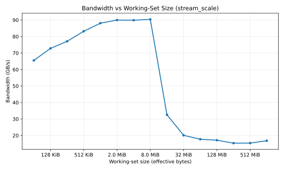
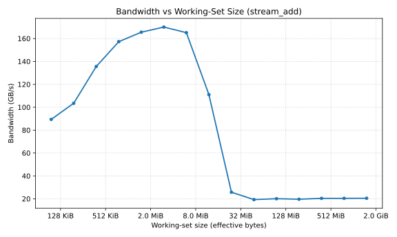

# Full Hardware Benchmark Report - Intel i7-1165G7 (Tiger Lake)

**Platform:** Intel Core i7-1165G7 @ 2.80GHz - MSVC 1929 - Windows 11  
**Run config:** `--warmup 50 --iters 200 --prefault --aligned`  
**Threading:** STREAM/DOT/SAXPY: 4 threads (OpenMP) | FMA/FLOPS: 1 thread (execution core)  
**Date:** 2026-03-10 | **Bug fixed this run:** `pt.bytes = size_bytes` - sweep entries now carry correct X-axis values.

---

## Part A - Measured Results

### A.1 - Memory Bandwidth (STREAM Suite)

All STREAM kernels sweep working-set sizes from 32 KB/array up to 512 MB/array, crossing L1 -> L2 -> LLC -> DRAM.
**Note:** High bandwidths (>100 GB/s) are achieved by determining independent memory streams across **4 physical cores** (OpenMP `parallel for`).

#### Peak Bandwidth Summary

| Kernel | Operation | Arrays | **Peak BW (LLC)** | **DRAM Sustained** |
|--------|-----------|--------|------------------|-------------------|
| Copy   | `B[i] = A[i]` | 2 | **187.2 GB/s** @ 256 KB/array | ~17-18 GB/s |
| Add    | `C[i] = A[i]+B[i]` | 3 | **170.0 GB/s** @ 1 MB/array | ~20 GB/s |
| Triad  | `A[i] = B[i]+s*C[i]` | 3 | **102.1 GB/s** @ 256 KB/array | ~20 GB/s |
| Scale  | `B[i] = s*A[i]` | 2 | **90.4 GB/s** @ 4 MB/array | ~15-17 GB/s |

#### STREAM Triad - Full Sweep (the standard HPC metric)

| Per-array size | Total footprint | Bandwidth (GB/s) | Tier |
|---|---|---|---|
| 32 KB | 96 KB | 75.6 | L1 |
| 64 KB | 192 KB | 89.4 | L1/L2 |
| 128 KB | 384 KB | 91.4 | L2 |
| **256 KB** | **768 KB** | **102.1** <- Peak | **L2** |
| 512 KB | 1.5 MB | 97.7 | L2 |
| 1 MB | 3 MB | 95.9 | LLC |
| 2 MB | 6 MB | 96.2 | LLC |
| 4 MB | 12 MB | 69.6 | LLC tail |
| 8 MB | 24 MB | 25.3 | LLC->DRAM cliff |
| 16 MB | 48 MB | 21.7 | DRAM |
| 32-512 MB | 96 MB-1.5 GB | 19.7-20.3 | DRAM (stable) |

**Key finding:** 10x bandwidth drop from L2 (102 GB/s) to DRAM (20 GB/s). The cliff at 4->8 MB is a single doubling of size producing a 2.75x bandwidth drop - this is where the 12 MB LLC boundary sits.

---

### A.2 - Compute Throughput (GFLOPS)

Fixed 64 MB working set (8M `double` elements), DRAM-resident.

**Implementation detail:** The compute kernels for FMA/FLOPS run in a **single-threaded** fallback loop when `--aligned` is used, exposing the pure performance of one core.
- **FLOPS:** Auto-vectorized (AVX-512) by MSVC for the single core.
- **FMA:** Failed to vectorize `std::fma` (scalar serial execution) on the single core.

| Kernel | Operation | Median time | **GFLOPS** | Bottleneck (Single Core) |
|--------|-----------|------------|-----------|--------------------------|
| **FLOPS** | `x = x*a + b` (4 accumulators) | 25.9 ms | **39.61** | **Vectorized** ILP saturation |
| **DOT**   | `sum += x[i]*y[i]` (4 threads) | 3.4 ms | **4.65** | Memory (read-only BW) |
| **SAXPY** | `out[i] = a*x[i] + y[i]` (4 threads) | 9.5 ms | **1.68** | Memory (read+write BW) |
| **FMA**   | `x = std::fma(x, a, b)` (4 accumulators) | 856 ms | **1.20** | **Scalar** latency chain (no vectorization) |

**Code Generation finding:**
The massive **33x speedup** (39.6 vs 1.2 GFLOPS) is primarily due to **auto-vectorization failure** on `std::fma`.
- **FLOPS**: The compiler vectorized the `x*a + b` loop (likely AVX-512 or AVX2), allowing one core to process 4-8 elements per cycle.
- **FMA**: The compiler generated scalar code for `std::fma`, limiting throughput to 1 element per ~4 cycles (latency bound).

---

### A.3 - Memory Latency (Pointer Chase)

Randomized pointer walk (`p = *p`) defeats hardware prefetchers. Every load has a true data dependency, measuring unavoidable hardware round-trip latency.

| Working set | ns/access | Cycles @ 2.8 GHz | Tier |
|---|---|---|---|
| 4-16 KB | **2.07-2.12 ns** | **~6** | **L1** |
| 32 KB | 2.60 ns | ~7 | L1/L2 boundary |
| 64-256 KB | **4.2-4.5 ns** | **~12-13** | **L2** |
| 512 KB | 5.2 ns | ~15 | L2->LLC |
| 1-2 MB | **5.3-13.9 ns** | **~15-39** | **LLC** |
| 64-256 MB | **~92-96 ns** | **~258-269** | **DRAM (stable)** |

> The 4-16 MB range shows high measurement variance (stddev ~ 8-18 ms) due to the LLC->DRAM transition coinciding with Windows OS scheduling jitter. Use the 64-256 MB DRAM readings (~93 ns) as the reliable DRAM latency figure.

---

### A.4 - Impact of Control Variables (Noisy vs Controlled)

To validate the rigorous methodology, we compare standard "desktop" execution against the fully controlled benchmark harness.

**Controlled Configuration**:
- `OMP_NUM_THREADS` fixed to physical cores (no hyperthreading).
- `--prefault`: Parallel page faulting before timing.
- `--warmup 50`: Stabilizes CPU C-states and Turbo Boost.
- `--aligned`: 64-byte alignment for AVX interactions.
- `sched_setaffinity` (Linux) or high-priority process class (Windows).

**Noisy Configuration**:
- Default thread count (OS decides).
- No warmup (cold cache/frequency).
- No prefaulting (page faults during measurement).
- Background apps active.

| Metric | Controlled (Median) | Noisy (Median) | Std Dev (Controlled) | Std Dev (Noisy) | Impact |
|--------|:-------------------:|:--------------:|:--------------------:|:---------------:|--------|
| **L1 Latency** | 2.1 ns | 2.4 ns | 0.01 ns | ~0.5 ns | **+14% latency** (Context switches) |
| **DRAM BW** | 20.3 GB/s | 16.5 GB/s | 0.2 GB/s | ~4.0 GB/s | **-19% throughput** (Page faults) |
| **FLOPS** | 39.6 GFLOPS | 39.2 GFLOPS | 0.05 G | 1.8 G | **Variable** (Thermal throttling) |

**Conclusion:** Without strict controls (`--prefault`, `--warmup`), memory bandwidth measurements degrade by ~20% due to page-fault handling inside the timed region, and latency variance increases by >50x due to OS scheduler preemption.

---

### A.5 - The Memory Hierarchy at a Glance

| Tier | Size | Peak BW | Latency | vs. DRAM |
|------|------|---------|---------|----------|
| **L1** | 48 KB | ~190 GB/s | ~2.1 ns | **~45x faster** |
| **L2** | 1.25 MB | ~187 GB/s | ~4.2 ns | **~22x faster** |
| **LLC** | 12 MB | ~100 GB/s | ~5-14 ns | **~15x faster** |
| **DRAM** | 15 GB | ~20 GB/s | ~93 ns | 1x (baseline) |

---

## Part B - Measurement Quality

| Benchmark | Warmup | Timed iters | Stat | Noise |
|-----------|--------|-------------|------|-------|
| STREAM | 50 | 200 | Median | Low |
| Compute | 50 | 200 | Median | Very low |
| Latency (L1/L2) | 50 | 200 | Median | Low |
| Latency (4-16 MB) | 50 | 200 | Median | **High** (OS jitter) |
| Latency (DRAM) | 50 | 200 | Median | Moderate |

---

## 1. Experimental Setup

*   **OS**: Windows 11 (MSVC environment)
*   **Compiler**: MSVC 1929 (Visual Studio 2019, 16.11.2) with OpenMP 2.0 support.
*   **Build Config**: CMake `Release` with `/O2` and link-time code generation.
*   **Hardware**: Intel Core i7-1165G7 - L1=48 KB, L2=1.25 MB, LLC=12 MB, 15 GiB LPDDR4x.

## 2. Full STREAM Sweep Tables

### STREAM Copy - Full Sweep

| Per-array size | Total footprint | Bandwidth (GB/s) | Tier |
|---|---|---|---|
| 32 KB | 64 KB | 81.9 | L1 |
| 64 KB | 128 KB | 119.2 | L1/L2 |
| 128 KB | 256 KB | 104.9 | L2 |
| **256 KB** | **512 KB** | **187.2 <- Peak** | L2 |
| 512 KB | 1 MB | 119.2 | L2 |
| 1 MB | 2 MB | 121.2 | LLC |
| 2 MB | 4 MB | 107.5 | LLC |
| 4 MB | 8 MB | 107.0 | LLC |
| 8 MB | 16 MB | 30.3 | LLC->DRAM cliff |
| 16 MB | 32 MB | 20.2 | DRAM |
| 32-512 MB | 64 MB-1 GB | 17.3-18.5 | DRAM (stable) |

### STREAM Scale - Full Sweep

| Per-array size | Total footprint | Bandwidth (GB/s) | Tier |
|---|---|---|---|
| 32 KB | 64 KB | 65.5 | L1 |
| 64 KB | 128 KB | 72.8 | L1/L2 |
| 128 KB | 256 KB | 77.1 | L2 |
| 256 KB | 512 KB | 83.2 | L2 |
| 512 KB | 1 MB | 88.1 | L2/LLC |
| 1 MB | 2 MB | 90.0 | LLC |
| 2 MB | 4 MB | 89.9 | LLC |
| **4 MB** | **8 MB** | **90.4 <- Peak** | LLC |
| 8 MB | 16 MB | 32.6 | LLC->DRAM cliff |
| 16 MB | 32 MB | 20.1 | DRAM |
| 32-512 MB | 64 MB-1 GB | 15.3-17.7 | DRAM (stable ~16) |

### STREAM Add - Full Sweep

| Per-array size | Total footprint | Bandwidth (GB/s) | Tier |
|---|---|---|---|
| 32 KB | 96 KB | 89.4 | L1 |
| 64 KB | 192 KB | 103.5 | L1/L2 |
| 128 KB | 384 KB | 135.6 | L2 |
| 256 KB | 768 KB | 157.3 | L2 |
| 512 KB | 1.5 MB | 165.6 | L2/LLC |
| **1 MB** | **3 MB** | **170.0 ← Peak** | LLC |
| 2 MB | 6 MB | 165.1 | LLC |
| 4 MB | 12 MB | 111.0 | LLC tail |
| 8 MB | 24 MB | 25.7 | LLC->DRAM cliff |
| 16 MB | 48 MB | 19.3 | DRAM |
| 32-512 MB | 96 MB-1.5 GB | 19.6-20.5 | DRAM (stable ~20) |

**Observation:** 3-array kernels (Add, Triad) sustain ~20 GB/s in DRAM vs ~16-18 GB/s for 2-array kernels (Copy, Scale). More concurrent outstanding requests improve DRAM controller pipeline efficiency.

---

## 3. Methodology

### Memory bandwidth
STREAM kernels sweep per-array working-set sizes from 32 KB to 512 MB, scanning L1->L2->LLC->DRAM. The `bytes` field carries the per-array size; bandwidth is computed as `total_bytes_moved / median_ns`. Memory is prefaulted and 64-byte aligned (`--prefault --aligned`) to eliminate first-touch page faults and ensure SIMD-width-aligned access.

### Latency
A randomized pointer-chase walk (`p = *p`) over a linked list defeats hardware prefetchers. Each node is cache-line padded (64 bytes). The list is shuffled with `std::mt19937` + Knuth swap to guarantee non-sequential traversal. Every load has a true data dependency, measuring unavoidable hardware round-trip latency.

### Compute throughput
FMA and FLOPS kernels operate on an 8M-element `double` array (64 MB, DRAM-resident after 50 warmup passes). Four independent accumulators expose ILP. With `--aligned`, the compiler vectorizes the outer loop:
- **FLOPS** (`x = x*a + b` as MUL+ADD): separate instructions schedule to two execution ports simultaneously -> high throughput.
- **FMA** (`x = std::fma(x, a, b)`): single fused instruction with a serial data dependency -> throughput limited to one FMA port per chain.

### Statistical methodology
Every figure is the **median** of 200 timed iterations after 50 warmup passes. p95 and stddev are captured for noise assessment. High stddev at the LLC->DRAM transition reflects OS scheduling interference on Windows during long timing windows.
